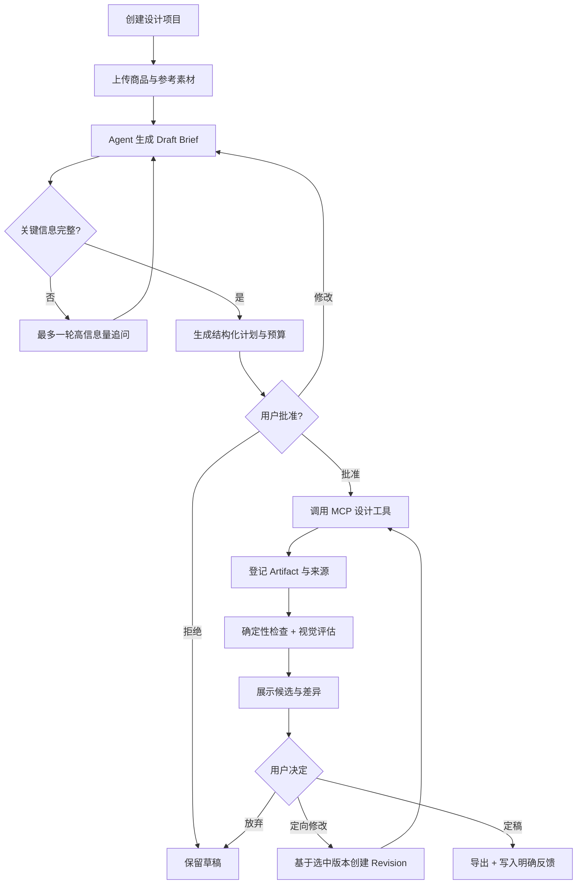
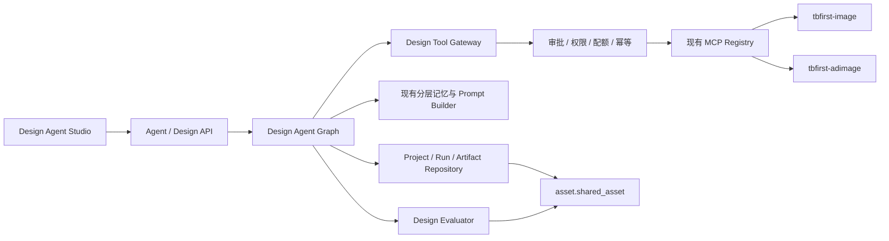

# my1 设计 Agent MVP 开发设计文档

> 状态：Draft v0.1
> 目标分支：`my1`
> MVP 定位：面向电商视觉场景、以作品为中心、有人类审批的设计 Agent
> 核心路径：商品素材 + 设计意图 -> 结构化 brief -> 方案与预算确认 -> 生成候选 -> 评估与修改 -> 定稿交付

## 1. 结论

`my1` 已经具备一个较强的通用 Agent 内核，但还不是完整的设计 Agent。

现有优势包括：LangGraph 执行图、Plan/Replan、Reflection/Reflexion、分层记忆、上下文压缩、Prompt 分层治理、工具预算，以及广告图、改款、分镜、视频和多阶段生图等业务能力。真正的缺口不在“模型还不够聪明”，而在以下几件事尚未形成统一闭环：

1. Agent 以对话为中心，没有稳定的设计项目、brief、作品、版本和用户决策状态。
2. 通用 Agent 的工具面只有 5 个工具；丰富的 MCP 设计工具尚未接入 Agent 图。
3. 生成结果只作为 ToolMessage 文本处理，缺少可追踪的 Artifact、父子版本和交付状态。
4. 当前反思器只粗略判断文本或 data URI，无法可靠评价 MCP 返回的 URL 作品，也没有设计维度评分。
5. 缺少生成前审批、预算授权、失败恢复和幂等执行；`requires_confirmation` 目前只是元数据，没有形成执行门。
6. `/agent` 前端仍是聊天页，无法承担素材、brief、候选方案、画布、版本对比和定稿工作流。

因此 MVP 不应继续扩展更多 Agent 范式，也不应一开始做“万能设计师”。最有效的路线是选择一个真实、高频、现有能力覆盖最好的黄金任务：**电商广告视觉设计**，将智能内核与现有广告图/生图生产线接通。

## 2. MVP 定义

### 2.1 目标用户

- 内部电商运营、视觉设计师和品牌内容人员。
- 有商品图、品牌约束或参考图，希望快速得到可用广告视觉。
- 愿意在关键节点确认方向，但不希望手动填写完整参数表。

### 2.2 黄金任务

用户上传 1 至 4 张商品素材，可选上传参考图，然后用自然语言描述目标。Agent 完成：

1. 识别素材角色并形成结构化设计 brief。
2. 只追问影响结果的缺失信息，最多一轮 3 个问题。
3. 给出设计方向、候选数量、预计工具调用和成本上限。
4. 用户一次批准本轮设计计划。
5. 调用既有 MCP 工作流生成 1 至 3 个候选。
6. 对候选做确定性检查和视觉评估，展示评分、风险和修改建议。
7. 用户选择候选并用自然语言定向修改，形成可回退的新版本。
8. 用户确认定稿后下载作品，并将明确反馈写入合适的记忆层。

### 2.3 成功标准

- 用户无需离开 `/agent` 即可完成一轮广告视觉设计。
- 每个生成结果都有来源、参数、评估、父版本和所属项目。
- 未经用户批准，不执行消耗额度或写入资产的生成工具。
- 页面刷新或 SSE 断开后，项目、作品和待审批动作可恢复。
- 用户说“保留商品，只改背景/文案/颜色”时，Agent 能引用选中作品，而不是重新从零猜测。
- 只有用户明确选中或定稿的结果，才进入正向偏好或成功流程记忆。

### 2.4 非目标

MVP 暂不包含：

- Figma/Photoshop 级自由矢量编辑、图层混合和钢笔工具。
- Logo、字体、完整 VI 系统的自动品牌设计。
- 多 Agent 角色会议、开放式 Agent 团队或工具市场。
- 视频成片、完整分镜制作和服装改款的统一编排；这些在后续复用同一框架。
- 无人审批的全自动批量生产。
- 训练或微调专用生成模型。

## 3. 现状能力与缺口

| 能力 | 当前基础 | MVP 判断 |
|---|---|---|
| Agent 编排 | `app/agent/graph` 已有 ReAct、Plan/Replan、Reflection、Reflexion | 保留，扩展为设计状态机 |
| 上下文治理 | L1-L4 压缩、Session Memory、工具结果落盘和熔断 | 直接复用，作品只存引用，不把图片塞入 checkpoint |
| 记忆 | 基础规则、用户偏好、Recall、Workflow、Shared Knowledge | 保留，但补充项目记忆与明确反馈边界 |
| Prompt 治理 | section 分层覆盖、动态边界、工具说明文件 | 保留，新增 brief/artifact/plan sections，工具说明改为注册表驱动 |
| 设计工具 | MCP 已有广告图、多阶段生图、改款、分镜、视频提示等 | P0 接入广告图和精修相关白名单工具 |
| 作品工作台 | AdImage 已有槽位画布、项目 `doc_json` 和自动保存 | 复用画布经验；Agent 侧建立跨工具 Artifact 模型 |
| 设计评估 | 有文本/图片 LLM rubric | 改为结构化多维评估；禁止评估异常伪装成满分 |
| 人类介入 | Prompt 约定“先确认再生图” | 改为后端强制审批，不能只依赖 Prompt |
| Agent 前端 | 三栏聊天、会话、工具状态和 SSE | 升级为项目 + 对话/brief + 作品工作区 |
| 身份与权限 | Agent SSE 代理目前主要透传 `X-User-Id` | P0 补齐 token、角色、组身份透传，复用 MCP policy |
| 数据迁移 | `ai` schema 主要依赖初始化 SQL | P0 引入可重复执行的 Python 服务迁移机制 |

## 4. 产品原则

### 4.1 作品优先，而非聊天优先

聊天是输入方式，不是真相源。设计项目的真相源应是结构化 brief、Artifact、版本关系、用户选择和交付状态。模型输出的自然语言不能替代这些对象。

### 4.2 生成前确认，生成后可追溯

所有会消耗额度或写资产的动作必须被一个明确的授权覆盖。授权绑定计划版本、工具白名单、最大生成次数和有效期，避免用户批准 A 后 Agent 实际执行 B。

### 4.3 记忆分层，拒绝污染

- 用户偏好：跨品牌、长期且稳定的个人偏好。
- 品牌规则：绑定 `brand_id`，高于个人偏好。
- 项目决定：只属于当前项目，放在 brief/decision log，不进入长期向量记忆。
- 成功流程：仅在用户确认定稿后写入 Workflow Memory。
- Reflexion：保存执行教训，不保存“用户喜欢某个风格”之类未经确认的推断。
- 被拒绝候选：只能形成负向约束或本项目反馈，不能作为正向成功样本。

### 4.4 有限自治

Agent 可以自行分析、规划、检查和组织结果；在费用、资产写入、最终交付等关键边界上由用户决定。MVP 的目标是可靠协作，不是最大自治。

## 5. 用户体验

### 5.1 页面结构

`/agent` 升级为 Design Agent Studio：

- 左侧：设计项目列表，展示状态、封面和最近更新时间。
- 中间：对话与结构化 brief；追问、计划和审批都在这里完成。
- 右侧：作品区，展示素材、候选、版本树、评估和定稿操作。
- 选中作品后进入轻量编辑态，可填写“修改要求”并复用 AdImage 槽位画布进行布局微调。
- 工具列表不再占据主工作区，仅在运行详情中展示。

移动端先保证查看、审批、选择和自然语言修改；复杂槽位拖拽只保证桌面端。

### 5.2 主流程



### 5.3 审批交互

审批卡必须显示：

- 本轮目标和输出数量。
- 将调用的工具。
- 预计最多生成次数、配额类型和成本级别。
- 使用的商品/参考素材。
- 会产生的写操作。

“批准”授权整个计划版本，而不是每张图弹一次确认。任何计划、素材、候选数或工具集合变化都会使旧授权失效。

## 6. 总体架构



关键决策：

1. **不复制 MCP 业务逻辑。** Agent 通过进程内 `Design Tool Gateway` 调用 `app.mcp_server.registry.call_tool`，统一复用 schema、审计、权限和配额。
2. **MCP 工具不全部暴露给模型。** 根据任务阶段提供最小白名单，MVP 只开放广告图、Banner、精修和调色相关工具。
3. **图片不进入 LangGraph State。** State 只保存 `artifact_id`、`asset_id`、安全 URL 和短摘要，二进制由共享资产层管理。
4. **项目状态独立于对话 checkpoint。** checkpoint 可压缩或重建，项目与 Artifact 仍然完整。
5. **评估结果是数据对象。** 不再通过倒序扫描 ToolMessage 猜测“最近作品”。

## 7. 领域模型

### 7.1 DesignBrief

```python
class DesignBrief(BaseModel):
    objective: str
    deliverable: Literal["ecommerce_ad"]
    product_asset_ids: list[int]
    reference_asset_ids: list[int] = []
    audience: str | None = None
    channel: str | None = None
    aspect_ratios: list[str] = []
    creative_direction: str | None = None
    copywriting: dict[str, str] = {}
    hard_constraints: list[str] = []
    acceptance_criteria: list[str] = []
    unknown_fields: list[str] = []
    status: Literal["draft", "ready", "approved"]
    version: int
```

`unknown_fields` 只记录真正阻塞生成的信息。Agent 不应因为可使用合理默认值的字段持续追问。

### 7.2 DesignPlan

```python
class DesignStep(BaseModel):
    id: str
    kind: Literal["analyze", "generate", "evaluate", "revise", "deliver"]
    title: str
    tool_name: str | None = None
    input_refs: list[str] = []
    acceptance_criteria: list[str] = []
    status: Literal["pending", "running", "done", "failed", "skipped"]

class DesignPlan(BaseModel):
    version: int
    brief_version: int
    steps: list[DesignStep]
    max_generation_calls: int
    candidate_count: int
    estimated_cost_level: Literal["low", "medium", "high"]
```

现有 `plan: list[str]` 可以继续用于普通对话；设计模式必须使用结构化 `DesignPlan`，否则无法做审批指纹、幂等和前端进度恢复。

### 7.3 Artifact

```python
class ArtifactRef(BaseModel):
    id: int
    project_id: int
    run_id: int
    shared_asset_id: int | None
    parent_artifact_id: int | None
    role: Literal["source", "reference", "candidate", "revision", "final"]
    kind: Literal["image", "layout", "text"]
    revision: int
    url: str | None
    width: int | None
    height: int | None
    prompt_snapshot: str | None
    tool_name: str
    tool_input_hash: str
    evaluation: dict | None
    status: Literal["creating", "ready", "failed", "selected", "final"]
```

### 7.4 EvaluationReport

```python
class EvaluationReport(BaseModel):
    status: Literal["passed", "needs_review", "failed", "unknown"]
    overall_score: float | None
    dimensions: dict[str, float | None]
    hard_violations: list[str]
    observations: list[str]
    suggested_changes: list[str]
    evaluator_version: str
```

维度至少包括：需求匹配、品牌一致性、商品保真、构图与层级、文字可读性、渠道适配、安全合规。

评估服务异常时必须返回 `unknown`，不能像当前实现一样用 `score=1.0` 伪装成通过。

## 8. 数据设计

新增表归属 `ai` schema，二进制资产继续复用 `asset.shared_asset`。

### 8.1 `ai.design_project`

| 字段 | 说明 |
|---|---|
| `id`, `project_uuid` | 内部主键和外部稳定 ID |
| `user_id`, `group_id`, `brand_id` | 所属范围 |
| `session_uuid` | 关联 Agent 会话，可为空 |
| `title`, `status` | `draft/active/waiting_approval/completed/failed` |
| `brief_json`, `brief_version` | 结构化 brief 及乐观锁版本 |
| `selected_artifact_id` | 当前选中作品 |
| `create_time`, `update_time`, `deleted` | 生命周期 |

### 8.2 `ai.design_run`

记录一次用户请求触发的执行：`project_id`、`request_id`、`status`、`plan_json`、`plan_version`、`generation_calls`、`cost_json`、`error_code`、起止时间。`request_id` 唯一，用于 SSE 重试和接口幂等。

### 8.3 `ai.design_artifact`

记录作品谱系：`project_id`、`run_id`、`shared_asset_id`、`parent_artifact_id`、`role`、`kind`、`revision`、`tool_name`、`tool_input_hash`、`provenance_json`、`evaluation_json`、`status` 和时间字段。

### 8.4 `ai.design_action`

统一记录审批和用户决策：`action_uuid`、`project_id`、`run_id`、`action_type`、`plan_version`、`payload_hash`、`payload_json`、`risk_level`、`status`、`actor_id`、`expires_at`、`create_time`、`resolved_at`。

动作类型包括 `approve_plan`、`reject_plan`、`select_artifact`、`request_revision`、`accept_final`。审批执行必须以 `payload_hash + status=approved` 校验，且消费后不可重复使用。

### 8.5 迁移机制

`ai` schema 不能继续只依赖全新环境的 `infra/postgres/init.sql`。MVP 第一个工程任务是为 `tbfirst-ai-python` 引入 Alembic 或等价的有版本 SQL runner，并把现有 AI 表建立基线。开发环境初始化 SQL仍保留，但生产变更以迁移文件为准。

## 9. Agent 状态机

在现有 `AppState` 上新增设计域字段：

```python
project_id: int | None
run_id: int | None
brief: dict | None
brief_version: int | None
design_plan: dict | None
artifact_ids: list[int]
selected_artifact_id: int | None
pending_action_id: str | None
evaluation_report: dict | None
generation_calls: int
```

建议新增节点：

1. `load_design_project`：加载项目、brief、选中作品和待处理动作。
2. `interpret_brief`：把用户消息和附件合并到 Draft Brief，使用 schema 校验。
3. `brief_gate`：判断是否需要追问；可默认的字段不阻塞。
4. `design_plan`：生成结构化计划和调用预算。
5. `approval_gate`：校验授权；无授权则持久化 action、发送事件并正常结束本轮。
6. `execute_design_step`：通过 Tool Gateway 执行 MCP 工具。
7. `register_artifacts`：将 MCP assets 登记为 Artifact。
8. `evaluate_artifacts`：确定性检查后调用视觉评估器。
9. `repair_gate`：只对硬违规允许一次预算内自动修复；软问题交给用户决定。
10. `present_candidates`：生成差异摘要，不替用户选择。
11. `finalize_design`：设置 final、生成交付摘要，并按记忆规则写入。

普通聊天继续走现有图。只有 `project_id` 存在或任务被分类为设计任务时，进入设计子图，避免破坏 `my1` 原有 Agent 范式。

## 10. Tool Gateway

### 10.1 MVP 工具白名单

- `tbfirst_check_workspace`
- `tbfirst_create_adimage_set`
- `tbfirst_image_phase3_banner`
- `tbfirst_image_phase2_refine`
- `tbfirst_image_phase2_color`

后续再接服装改款、分镜和视频。MVP 不把通用 Gateway 工具全部暴露给模型。

### 10.2 执行规则

- 从 MCP `ToolSpec` 动态生成 LangChain tool schema，删除 Agent 侧重复手写描述。
- Tool Gateway 构造完整 `McpContext`，包含 token、用户、角色、组和 trace ID。
- `writes_assets=true`、`quota_type != null` 或 `requires_confirmation=true` 的工具必须校验有效 ActionGrant。
- 在消费配额前先检查审批和幂等键，避免重复请求导致重复扣额。
- 工具输出统一转换为 `McpToolResult`，再由 `register_artifacts` 落库。
- 超时后将 run 标为 `unknown` 并允许按幂等键查询，不直接重试写工具。

### 10.3 身份链路修复

当前 Java `AgentController` 的 SSE 代理主要只向 Python 透传 `X-User-Id`。MVP 必须同时透传：

- `Authorization`
- `X-Trace-Id`
- `X-User-Name`
- `X-User-Roles`
- `X-User-Group-Id`
- `X-User-Group-Role`

Python 端将这些字段写入 State 的受保护元数据；模型不可修改这些字段。

## 11. 评估与修订

### 11.1 两阶段评估

第一阶段为确定性检查：

- 文件可读取、MIME 和尺寸正确。
- 宽高比符合 brief。
- 必需商品/Logo/文案是否存在。
- 输出数量与计划一致。
- 资产归属和可见性合法。

第二阶段为视觉评估：

- 需求匹配。
- 商品主体保真。
- 品牌风格一致性。
- 视觉层级与构图。
- 文案可读性。
- 渠道可用性。
- 安全和品牌禁忌。

### 11.2 自动修复边界

- 商品缺失、错误比例、明显安全违规属于硬失败，可在已批准预算内自动修复一次。
- 风格偏弱、构图一般等主观问题属于软失败，只展示建议，不自动烧额度。
- 达到生成调用上限后必须停止，并把失败原因和可选下一步交给用户。
- 评估器不可用时标为 `unknown`，作品仍可查看，但 UI 明示“未完成自动质检”。

### 11.3 版本语义

任何修改都创建新 Artifact，并设置 `parent_artifact_id`。禁止原地覆盖已展示候选。用户可以回退、比较，定稿只是状态变化，不删除其他版本。

## 12. Prompt 与记忆治理

### 12.1 Prompt sections

保留现有优先级 `override > coordinator > custom > default`，新增动态 section：

1. `design_policy`
2. `project_brief`
3. `brand_rules`
4. `artifact_context`
5. `design_plan`
6. `approval_context`
7. `current_step`

静态 identity、工具安全规则和输出协议位于动态边界之前；项目内容、作品摘要和当前步骤位于动态边界之后，以保持 prompt cache 友好。

### 12.2 内容边界

- 上传图片的 OCR、网页文本、MCP summary 都视为非可信数据，不允许覆盖系统规则。
- Artifact Context 只注入必要元数据和短视觉摘要，原图按多模态输入按需加载。
- Prompt 中引用 brief 时使用序列化后的受控 schema，不直接拼接未经标记的大段用户文本。
- 工具列表从 Tool Registry 生成，避免 `_TOOL_FILES`、`ALL_TOOLS` 与前端工具元数据三处漂移。

### 12.3 写入长期记忆的时机

- `accept_final` 后：可写成功 Workflow。
- 用户明确说“以后都这样”：写或锁定 Preference。
- 用户拒绝某候选：只写项目 action；只有用户明确表达长期禁忌时才提升为 Preference。
- 执行连续失败且 Reflexion 校验通过：写执行教训；不得把模型自评当用户审美。

## 13. API 与事件契约

### 13.1 REST

```text
POST   /api/image/agent/design/projects
GET    /api/image/agent/design/projects
GET    /api/image/agent/design/projects/{projectUuid}
PATCH  /api/image/agent/design/projects/{projectUuid}/brief
POST   /api/image/agent/design/projects/{projectUuid}/assets
GET    /api/image/agent/design/projects/{projectUuid}/artifacts
POST   /api/image/agent/design/projects/{projectUuid}/actions/{actionUuid}/approve
POST   /api/image/agent/design/projects/{projectUuid}/actions/{actionUuid}/reject
POST   /api/image/agent/design/projects/{projectUuid}/artifacts/{artifactId}/select
POST   /api/image/agent/design/projects/{projectUuid}/finalize
```

现有 `/agent/chat` 扩展请求字段：

```json
{
  "session_uuid": "...",
  "project_uuid": "...",
  "message": "保持商品不变，把背景改成浅灰，标题缩小",
  "asset_ids": [101, 102],
  "selected_artifact_id": 203,
  "request_id": "client-generated-uuid"
}
```

### 13.2 SSE

```text
run_started
brief_updated
clarification_required
plan_updated
approval_required
tool_started
tool_completed
artifact_created
evaluation_completed
message_chunk
run_completed
run_failed
```

所有事件至少包含 `request_id`、`project_uuid`、`run_id`、`sequence` 和 `timestamp`。前端按 `run_id + sequence` 去重；重连后先拉项目快照，再继续接收新事件。

`artifact_created` 直接携带 ArtifactRef 的安全子集，前端不再从任意 ToolMessage JSON 中猜图片 URL。

## 14. 前端开发范围

### 14.1 复用

- 复用现有 Agent 会话、SSE 客户端和响应式三栏布局。
- 复用 `AdImageWorkbench` 的槽位模型、画布拖拽和自动保存经验。
- 复用全局 Staging Tray 和上传服务作为素材入口。
- 复用现有图片代理和错误回退。

### 14.2 新增

- `DesignProjectRail`：项目而非纯会话列表。
- `BriefEditor`：结构化字段、缺失项和版本状态。
- `PlanApproval`：计划、成本和授权范围。
- `ArtifactGallery`：候选、评分、状态和选择。
- `ArtifactCompare`：父子版本并排对比。
- `RevisionComposer`：绑定选中 Artifact 的自然语言修改框。
- `RunTimeline`：工具执行与失败恢复详情。
- `FinalDelivery`：定稿、下载和交付摘要。

MVP 不在聊天气泡里嵌套完整工作台。聊天区负责意图和决策，作品区负责查看和操作。

## 15. 实施拆分

### Sprint 0：工程地基（2-3 天）

- 为 `ai` schema 建立版本化迁移。
- 补齐 Agent 身份头透传。
- 定义 DesignBrief、DesignPlan、ArtifactRef、EvaluationReport 和 SSE schema。
- 增加 `DESIGN_AGENT_ENABLED` feature flag。

验收：迁移可在空库和已有库各执行一次；普通 Agent 行为不变；身份字段不可由请求 body 覆盖。

### Sprint 1：项目与作品状态（4-5 天）

- 建立 project/run/artifact/action repository。
- 新增项目、brief、artifact 和 action API。
- 前端完成项目列表、BriefEditor 和 ArtifactGallery 骨架。
- 支持刷新恢复和 Artifact 版本关系。

验收：可以创建项目、关联素材、保存 brief、登记模拟候选、选择和回退版本。

### Sprint 2：MCP 工具与审批（5-6 天）

- 实现 Design Tool Gateway 和 MCP schema 动态适配。
- 接入广告图、Banner、精修、调色白名单。
- 实现 PlanApproval、ActionGrant、幂等和配额前置校验。
- 扩展 SSE 事件。

验收：未批准时零生成调用；批准后最多执行计划声明次数；重复 approve/request 不产生重复资产或重复扣额。

### Sprint 3：评估、修订和定稿（5-6 天）

- Artifact 驱动的确定性检查和视觉评估。
- 一次硬失败自动修复。
- 选中作品后的自然语言修订与父子版本。
- 定稿、下载和成功 Workflow 写入。

验收：完整黄金任务可端到端完成，评估失败标为 unknown，不阻断作品查看，不伪装成满分。

### Sprint 4：质量与灰度（3-4 天）

- 30 个固定 brief 的 Agent eval 集。
- 工具失败、SSE 断线、刷新、超时和配额耗尽测试。
- 运行指标、审计日志和成本看板。
- 仅对内部用户灰度。

## 16. 测试策略

### 16.1 单元测试

- Brief 合并、默认值和阻塞字段判断。
- Plan schema、审批指纹和授权失效。
- Tool Gateway 白名单、身份隔离、幂等和配额顺序。
- Artifact 父子关系、状态转换和用户隔离。
- 评估器 `passed/failed/unknown` 行为。
- 记忆写入边界，尤其是拒绝结果不得进入正向 Workflow。

### 16.2 图测试

- 普通对话仍走原图。
- 设计任务缺信息时结束于 clarification。
- 未授权时结束于 approval_required，且没有工具调用。
- 授权后从持久化计划继续。
- 达到生成上限后不会循环。
- checkpoint 压缩后项目和 Artifact 不丢失。

### 16.3 集成与 E2E

- 使用 fake MCP server 验证结构化资产返回、超时和重复请求。
- 使用真实测试配额跑最小广告图链路。
- Playwright 覆盖创建项目、上传素材、批准、查看候选、修订、刷新恢复和定稿。
- 桌面与移动视口检查无文本溢出、作品遮挡和布局跳动。

### 16.4 Agent Eval 数据集

首批 30 个任务应覆盖：

- 信息完整/不完整 brief。
- 无参考图、单参考图、多参考图。
- 商品保真、指定比例、指定文案和禁用元素。
- 模糊审美表达和互相冲突的约束。
- 用户中途改方向、拒绝候选和回退旧版本。
- 工具失败、评估不可用、配额不足。

## 17. 指标与发布门槛

MVP 内测门槛：

- 黄金任务端到端完成率 >= 80%。
- 未批准的付费/写资产工具调用数 = 0。
- Artifact 来源与版本记录完整率 = 100%。
- 重复请求产生重复资产的比例 = 0。
- 刷新后项目恢复成功率 = 100%。
- 影响结果的追问中位数 <= 2 个问题。
- 单次 run 默认最多 4 次生成调用，其中自动修复最多 1 次。
- 硬违规测试集召回率 >= 90%；评估不可用必须 100% 标记为 unknown。
- 用户明确拒绝的候选写入正向记忆的次数 = 0。

产品观察指标还包括：候选被选中率、首次候选到定稿的修改次数、平均生成调用数、定稿耗时、用户主动回退率和每次定稿成本。

## 18. 风险与处理

| 风险 | 处理 |
|---|---|
| 通用 Planner 产生不可执行字符串计划 | 设计模式强制 Pydantic 结构化计划，schema 失败降级为重新规划 |
| MCP 与 Agent 身份上下文不一致 | 补齐代理头，Tool Gateway 只信服务端 State，不信模型参数 |
| SSE 断线导致重复生成 | request_id、action payload hash、tool input hash 三层幂等 |
| 评估器主观或不可用 | 确定性检查优先；多维报告；不可用标 unknown；不自动无限修复 |
| 图片 URL 过期 | Artifact 保存 shared_asset_id，展示时重新解析安全 URL |
| Prompt/记忆污染 | 结构化数据边界、来源标记、定稿后写记忆、Reflexion 单独治理 |
| State 过大拖垮 checkpoint | 只保存 ID 和摘要，图片及长工具结果外置 |
| MVP 被扩成全能设计平台 | 只验收 ecommerce_ad 黄金任务，其他业务只保留扩展接口 |

## 19. 代码落点建议

后端新增：

```text
tbfirst-ai-python/app/agent/design/models.py
tbfirst-ai-python/app/agent/design/repository.py
tbfirst-ai-python/app/agent/design/tools.py
tbfirst-ai-python/app/agent/design/evaluator.py
tbfirst-ai-python/app/agent/design/nodes.py
tbfirst-ai-python/app/routes/design.py
tbfirst-ai-python/migrations/<version>_design_agent.sql
```

后端改造：

```text
tbfirst-ai-python/app/agent/graph/state.py
tbfirst-ai-python/app/agent/graph/build.py
tbfirst-ai-python/app/agent/prompts/builder.py
tbfirst-ai-python/app/routes/agent.py
tbfirst-ai-python/app/mcp_server/policy.py
tbfirst-image/.../AgentController.java
tbfirst-image/.../AiPythonClient.java
```

前端新增或改造：

```text
tbfirst-frontend/pages/AgentPage.tsx
tbfirst-frontend/services/agent.ts
tbfirst-frontend/features/DesignAgent/
```

## 20. Definition of Done

MVP 完成必须同时满足：

1. 一名内部用户能从商品素材和一句自然语言需求开始，在 `/agent` 内完成候选生成、选择、修改、定稿和下载。
2. 生成前存在后端强制审批，绕过前端也不能执行未授权写工具。
3. 每个候选都有 project/run/artifact/provenance/evaluation/version 数据。
4. 设计状态不依赖未压缩聊天历史，刷新和压缩后仍可恢复。
5. 原有上下文压缩、记忆、Plan/Reflect/Reflexion 和 Prompt 治理测试不回归。
6. 所有身份、资产和项目查询均验证用户或组范围。
7. E2E 黄金任务、幂等、断线恢复、配额和失败降级测试通过。
8. 30 条 Agent Eval 达到发布门槛，才能从内部灰度扩大范围。

## 21. 推荐的第一步

第一阶段不要先改 UI，也不要先增加更多模型。先完成三个纵向基础件：

1. 建立 `DesignProject + Artifact + ActionGrant` 数据模型。
2. 做一个 `tbfirst_create_adimage_set` 的 Agent Tool Gateway 适配器。
3. 跑通“生成计划 -> 用户批准 -> 调用一次 -> Artifact 入库 -> SSE 展示”的最小闭环。

这条链路跑通后，精修、调色、版本对比、评估和其他设计业务都是在同一个可靠骨架上扩展，而不是继续形成新的孤岛。
